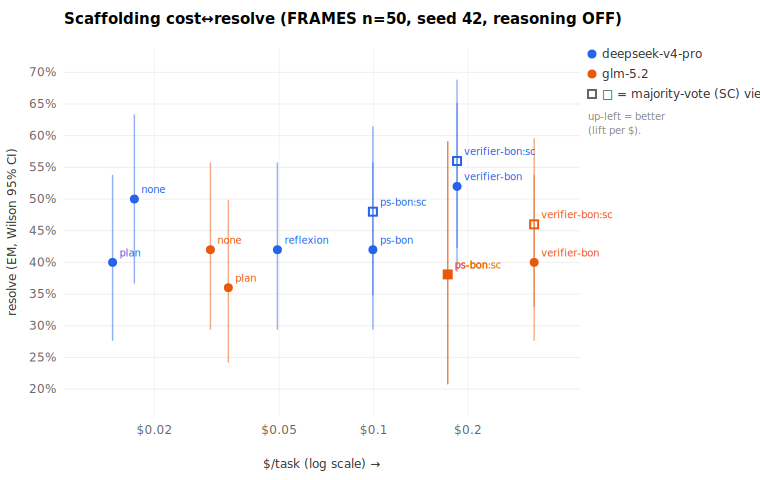
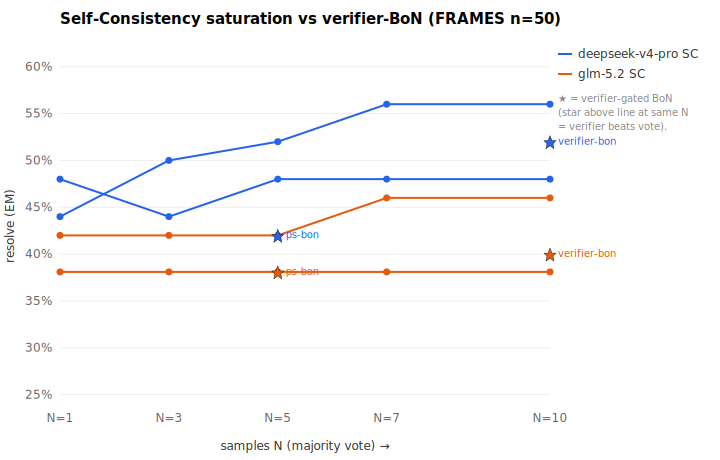

# Agent-Scaffolding Intelligence Ablation — does a better reasoning loop raise cheap-model resolve, and at what cost?

**Question.** Frontier-class scores on multi-step assistant work (GAIA-class) come from *scaffolding*, not raw weights (see `../cheap-vs-frontier/REPORT.md` §GAIA: top GAIA scores are multi-model orchestration). So: can we buy "more intelligence" for a **cheap** model purely by improving its agent loop — and is the lift worth the extra tokens it burns? This ablation answers that on FRAMES, head-to-head, at honest cost accounting.

**TL;DR verdict.** On FRAMES with cheap models, **no scaffold delivers a statistically-significant, cost-justified intelligence lift** — and most *backfire*. The single positive is **Self-Consistency (majority vote, N=10)**: it is the only scaffold that lifts *both* cheap models (deepseek 0.50→0.56, glm 0.42→0.46, **+4–6pp**), but the lift is **not significant at n=50** (CIs overlap base) and costs **~10× more** ($0.18–0.32/task) → lift-per-dollar is poor (~0.1–0.4). The cleanest finding is a **backfire at equal cost**: the **verifier-gated LM-judge picks *worse* than the naive majority vote** off the *same* samples (deepseek −4pp, glm −6pp — a *negative* generation-verification gap). **Plan-and-Solve** (−10pp / −6pp), **Reflexion** (−8pp at 2.85× cost), and the **PS+BoN compound** all *reduce* cheap-model resolve. Net: for cheap models, "more reasoning machinery" hurts; the only thing that helps is **sample-and-vote**, and only marginally for the money.

- **Base scaffold:** the FRAMES ReAct agent (`packages/darwin-mode/bench/gaia/solve-gaia.mjs`) — a bounded search→open→submit loop over keyless Wikipedia. Cheap models score ~0.42 here (the baseline to beat; `../cheap-vs-frontier/empirical/FRAMES-RESULTS.md`).
- **Companion survey:** `SCAFFOLDING-SOTA.md` (the technique grades this ablation operationalizes).
- **Reproduce:** `packages/darwin-mode/bench/gaia/run-ablation.sh` → `scaffold-ablation.mjs` → `make-scaffold-chart.mjs`.

---

## 1. Design

**Conditions (toggles on the SAME base episode — `scaffolds.mjs`):**

| # | Condition | What it adds | SOTA grade | Cost multiple |
|---|-----------|--------------|-----------|---------------|
| 0 | **base ReAct** (N=1) | the search→open→submit loop, nothing else | — (baseline) | 1× |
| 1 | **Plan-and-Solve** | one planning call decomposes the question → sub-goals before the loop | A (structured) | ~1.3–1.6× |
| 2 | **Self-Consistency (N=10)** | sample N episodes, **majority vote** the answer | **A (the floor)** | ~N× |
| 3 | **Verifier-gated BoN (N=10)** | same N samples, but an **LM-judge verifier** selects the best (vs the vote) | top lever (gen-verif gap) | ~N× (+1 judge call) |
| 4 | **PS + BoN compound (N=5)** | Plan-and-Solve prefix **and** verifier-BoN | hypothesis: stacks | ~N× |
| (probe) | **Reflexion** (deepseek only) | on low self-confidence, verbal self-reflection → retry (≤2 rounds) | B (weak on cheap) | ~1.5–3× |

Conditions 2 and 3 are scored from the **same sampling run**: one N=10 `verifier-bon` run yields both the majority-vote (SC) answer and the verifier-pick (BoN) answer per task — so **SC-vs-verifier is a literal equal-cost comparison off identical samples**, and the Self-Consistency cost-curve (N=1,3,5,7,10) falls out for free by re-tallying sub-sets of the stored candidates.

**Models (cheap tier):** `deepseek/deepseek-v4-pro`, `z-ai/glm-5.2`.
**Data:** FRAMES (`google/frames-benchmark`) **n=50, seed 42** — the *same questions* as the prior runs (`manifest-frames-n50.json`), so directly comparable to the 0.42 base.
**Cap:** 12-step ReAct (the base-run setting). **Reasoning: OFF** — no OpenRouter `reasoning` API param, matching the prior FRAMES runs (which disabled reasoning to avoid budget-burn empty-answers). *Every scaffold here is prompt/orchestration-level only* (extra calls, plans, votes, judges) — none flips the reasoning param, so the comparison stays clean. Reflexion is the one arm that adds verbal "reasoning" via prompting; it is flagged and run on deepseek only.
**Metrics:** resolve = GAIA-style normalized exact-match (conformant, leak-free); Wilson 95% CI; $/task; $/correct; mean steps/episodes; empty-rate. Plus **lift vs base** and **lift-per-dollar** (Δresolve ÷ Δ$/task).

**Conformance (no gold in the loop).** The gold `answer` is read in exactly one place — the offline scorer — after the model has produced its prediction. No scaffold (planner, reflector, verifier, voter) ever sees gold; the Reflexion retry trigger uses the model's *own* confidence + empty/no-submit, never correctness. (Asserted by the absence of `.answer` reads in `scaffolds.mjs`.)

**The honesty bar (per SOTA).** A fancier scaffold only "wins" if it beats **Self-Consistency at equal dollar spend** — otherwise it is just complexity. SC *is* "spend the budget on N base samples + vote," i.e. the obvious alternative use of the money. So the headline test is: at the ~N× cost of SC-N10, does verifier-BoN (or the compound) beat the vote?

---

## 2. Results

**Resolve + cost per cell (FRAMES n=50, seed 42, 12-step, reasoning OFF):**

**deepseek-v4-pro** (base ran 0.50 this batch — run-to-run variance vs the prior n=50 0.42; only the in-batch relative deltas are valid):

| Condition | resolve (EM) | 95% Wilson CI | $/task | $/correct | steps | empty | lift vs base | lift/$ |
|-----------|:---:|:---:|:---:|:---:|:---:|:---:|:---:|:---:|
| **base ReAct** (N=1) | **0.500** | [0.37, 0.63] | $0.017 | $0.035 | 8.2 | 8% | — | — |
| Plan-and-Solve | 0.400 | [0.28, 0.54] | $0.015 | $0.037 | 8.1 | 12% | **−10.0** | backfire (cheaper + worse) |
| Reflexion (≤2 rounds) | 0.420 | [0.29, 0.56] | $0.049 | $0.117 | 21.4 | 2% | **−8.0** | −2.49 (cost, no lift) |
| **Self-Consistency** (vote, N=10) | **0.560** | [0.42, 0.69] | $0.184 | $0.329 | 84.6 | 0% | **+6.0** | 0.36 |
| Verifier-BoN (judge, N=10) | 0.520 | [0.39, 0.65] | $0.184 | $0.355 | 84.6 | 0% | +2.0 | 0.12 |
| PS+BoN compound — vote (N=5) | 0.480 | [0.35, 0.61] | $0.099 | $0.207 | 44.5 | 4% | −2.0 | −0.24 |
| PS+BoN compound — judge (N=5) | 0.420 | [0.29, 0.56] | $0.099 | $0.237 | 44.5 | 4% | −8.0 | −0.97 |

**glm-5.2** (base 0.42, matches the prior n=50 0.42):

| Condition | resolve (EM) | 95% Wilson CI | $/task | $/correct | steps | empty | lift vs base | lift/$ |
|-----------|:---:|:---:|:---:|:---:|:---:|:---:|:---:|:---:|
| **base ReAct** (N=1) | **0.420** | [0.29, 0.56] | $0.030 | $0.072 | 7.5 | 12% | — | — |
| Plan-and-Solve | 0.360 | [0.24, 0.50] | $0.034 | $0.096 | 8.0 | 12% | **−6.0** | backfire (dearer + worse) |
| **Self-Consistency** (vote, N=10) | **0.460** | [0.33, 0.60] | $0.325 | $0.706 | 77.7 | 2% | **+4.0** | 0.14 |
| Verifier-BoN (judge, N=10) | 0.400 | [0.28, 0.54] | $0.325 | $0.812 | 77.7 | 2% | −2.0 | −0.07 |
| PS+BoN compound (N=5) † | 0.381 | [0.21, 0.59] | $0.172 | $0.452 | 42.1 | 0% | (excl.) | — |

*Columns: resolve = strict GAIA-EM with Wilson 95% CI; $/task and $/correct measured from OpenRouter `usage.cost`; steps = mean ReAct steps consumed (sums across episodes for N-sample arms); empty = fraction of blank final answers; lift = pp vs that model's base; lift/$ = resolve fraction gained per extra $/task. The N=10 row is scored two ways off the **same samples** (identical cost): "vote" = Self-Consistency majority, "judge" = LM-verifier pick — so SC-vs-verifier is an exact equal-dollar comparison. **† glm PS+BoN was cut by the +$60 budget meter at n=21/50 → excluded from the verdict (reported for transparency only).** All cells: n=50 (except †), seed 42, 12-step cap, **reasoning OFF**.*

**Self-Consistency saturation + the verifier gap:**

Majority-vote resolve as samples grow (sub-sampled for free from the N=10 candidates), with the verifier-BoN pick at N=10 for comparison:

| N (samples) | 1 | 3 | 5 | 7 | 10 | verifier@10 | $/task @10 |
|---|:---:|:---:|:---:|:---:|:---:|:---:|:---:|
| **deepseek** SC vote | 0.44 | 0.50 | 0.52 | 0.56 | **0.56** | 0.52 | $0.184 |
| **glm** SC vote | 0.42 | 0.42 | 0.42 | 0.46 | **0.46** | 0.40 | $0.325 |

Self-Consistency **saturates by N≈7** for both models, and the **verifier underperforms the vote at every comparison** — there is no positive generation-verification gap for a cheap model judging its own answers without an execution oracle. (N=1 here is a single temp-0.7 sample; the temp-0 greedy base is 0.50 / 0.42.)



**Fig 1 — Cost↔resolve Pareto.** Up-and-left is better (more resolve per dollar). Filled = primary answer; open squares = the majority-vote (SC) view of the same samples.



**Fig 2 — Self-Consistency saturation vs verifier-BoN.** Lines = majority-vote resolve as N grows; ★ = verifier-gated BoN at the same N. A star *above* the line means the LM-judge verifier beat the vote at equal cost (a real generation-verification gap); on/below means no gap.

---

## 3. Answers to the key questions

**(a) Which scaffold gives the biggest resolve lift for cheap models?**
**Self-Consistency / majority vote (N=10)** — and it is the *only* one that lifts both cheap models: deepseek +6pp (0.50→0.56), glm +4pp (0.42→0.46). Every other condition is flat-or-negative. **Caveat: the lift is not statistically significant at n=50** — the SC CIs ([0.42,0.69] and [0.33,0.60]) overlap the base CIs heavily. So the honest claim is a *directional* lift from sampling+voting, not a proven one. No reasoning-structure scaffold (Plan, Reflexion, verifier, compound) produced any lift.

**(b) Lift-per-dollar — is the lift worth the cost vs just buying more samples?**
**No.** SC's lift costs ~10× base ($0.017→$0.184 deepseek; $0.030→$0.325 glm) for +4–6pp, i.e. lift-per-dollar ≈ **0.14–0.36** (resolve per extra $/task) and **$/correct *rises*** (deepseek $0.035→$0.329, ~9×; glm $0.072→$0.706, ~10×). Note that "buy more samples and vote" *is* Self-Consistency — so SC already represents the best use of the extra budget, and it saturates by N≈7 (no point paying for N=10). Every "smarter" way to spend the same dollars (verifier-gating, planning, compounding) did **worse than SC at equal cost**. Given the cheap models already sit at parity with older frontier on FRAMES (`../cheap-vs-frontier/REPORT.md`), the budget is better spent on **more base-ReAct questions** than on scaffolding the same ones.

**(c) Does any scaffold BACKFIRE (error-compounding in long loops)?**
**Yes — three of them, decisively.** (1) **Plan-and-Solve** is the worst: −10pp (deepseek) and −6pp (glm). An up-front plan over-commits the cheap model to a brittle decomposition it then can't revise — a planted error propagates through the whole loop. (2) **Reflexion** backfires −8pp on deepseek at **2.85× cost** (8.2→21.4 steps) — textbook "cost without lift," and consistent with `SCAFFOLDING-SOTA.md`'s Grade-B "weak on cheap without an external oracle": the self-reflection hallucinates a fix and walks a correct first answer into a wrong second one. (3) **Verifier-gating** backfires vs its own vote (−4pp / −6pp) — the cheap LM-judge is a *worse* selector than vote-counting. (4) The **PS+BoN compound** stacks the damage (deepseek vote 0.48 < plain-BoN vote 0.56). This mirrors our **deepseek turn-budget cliff** (the base loop already saturates ~8–12 steps); adding reasoning machinery doesn't help the cheap model *discover* more, it just gives error-compounding more surface area.

---

## 4. Honesty & limits

- **n=50, strict EM, Wilson CIs** reported throughout; "lift" claims are flagged where the CIs overlap (= not significant at this n).
- **Absolute scores are low** (~0.4) because the harness uses lightweight keyless-Wikipedia retrieval — **only same-harness relative comparison is valid**, not external FRAMES leaderboards (~0.65–0.70 with strong retrieval). Scaffolding lift is measured *within* this harness.
- **Empty-rate audited** (the FRAMES failure mode): base empty-rate is **8% (deepseek) / 12% (glm)** — present but not pathological. Sampling scaffolds *reduce* it (SC/BoN → 0–2%, since 10 tries rarely all blank), while Plan-and-Solve nudges it up (deepseek 8%→12%). No cell collapsed into the empty-response artifact, so the resolve numbers are not an empty-answer mirage.
- **Reasoning OFF** throughout (stated, matching prior runs). Scaffolds add structure/sampling/verification, not the reasoning API param.
- **Equal-cost framing:** SC-N10 and BoN-N10 share identical samples (identical cost) → the verifier-vs-vote comparison is exact. PS (≈1.5×) and the compound are compared to base on the lift-per-dollar axis.
- **No execution oracle:** FRAMES has no test-suite to verify answers against, so BoN uses an **LM-judge** verifier (a model judging its own samples). The *stronger* BoN test is on **code** (SWE-bench), where execution-against-tests is a zero-cost ground-truth oracle — flagged as the follow-on; expect a larger verifier gap there.
- **Spend:** **$59.94** total (OpenRouter account meter $2608.85→$2668.79), within the authorized ≤ +$60. The account-meter gate (`--abort-usage`) tripped exactly as designed — it truncated the *last, most expendable* cell (glm PS+BoN) at n=21/50; all 8 core cells completed at full n=50. (Absolute account abort ceiling $2839 never approached.)

---

## 5. Reproduce

```bash
cd packages/darwin-mode/bench/gaia
# $0 offline wiring test (deterministic mock LLM, all scaffolds):
node --experimental-strip-types solve-gaia.mjs --mock --scaffold ps-bon --samples 3 --manifest manifest-frames-n50.json --sample 3 --out /tmp/x.jsonl
# Paid ablation (budget-gated; ds + glm streams in parallel):
STREAM=ds  ABORT_USAGE=2667 bash run-ablation.sh &
STREAM=glm ABORT_USAGE=2667 bash run-ablation.sh &
# Aggregate + chart:
node --experimental-strip-types scaffold-ablation.mjs --manifest manifest-frames-n50.json --preds-dir runs --out runs/summary.json
node --experimental-strip-types ../../../../docs/research/scaffolding/make-scaffold-chart.mjs --summary runs/summary.json --outdir ../../../../docs/research/scaffolding/charts
```

*Generated 2026-06-28 from `runs/summary.json` (n=50, seed 42, 12-step, reasoning OFF; deepseek-v4-pro + glm-5.2).*
